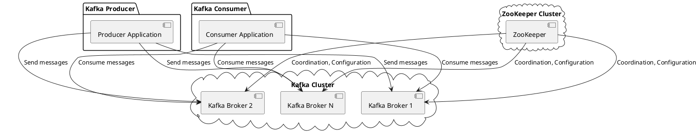

# Build C/C++ Kafka Producer and Consumer Applications

Building a simple Kafka application in C/C++ involves using the librdkafka library, which is a C library implementation of the Apache Kafka protocol. You'll need to install librdkafka and its C++ wrapper, cppkafka, to build Kafka clients in C/C++. We'll create a simple producer and consumer example to demonstrate basic data communication.

## **step 0: Prerequisites**

***Install OpenSSL libraries (if you haven't already), which are required for building cppkafka.***

For Debian/Ubuntu-based systems, run the following command to install the OpenSSL development package:

```bash
sudo apt-get install libssl-dev
```

For CentOS/RHEL-based systems, run the following command:

```bash
sudo yum install openssl-devel
```

For Fedora-based systems, run the following command:

```bash
sudo dnf install openssl-devel
```

If not installed, you will encounter error below while running `make` for install cppkafka,
```
/usr/bin/ld: cannot find -lssl
/usr/bin/ld: cannot find -lcrypto
```

***Install JDK (if you haven't already), which is required for running the ZooKeeper server.***

1. **Install OpenJDK 11**: Run the following commands to install OpenJDK 11:

```bash
sudo apt update
sudo apt install openjdk-11-jdk
```

2. **Set the `JAVA_HOME` environment variable**: After installing OpenJDK, set the `JAVA_HOME` environment variable to point to the JDK installation directory:

```bash
echo "export JAVA_HOME=$(dirname $(dirname $(readlink $(readlink $(which javac)))))" >> ~/.bashrc
source ~/.bashrc
```

## **Step 1: Install librdkafka and cppkafka**

Install librdkafka:

```bash
git clone https://github.com/edenhill/librdkafka.git
cd librdkafka
./configure --prefix=/usr
make
sudo make install
```

Install cppkafka:

```bash
git clone https://github.com/mfontanini/cppkafka.git
cd cppkafka
mkdir build
cd build
cmake .. -DRDKAFKA_ROOT_DIR=/usr
make
sudo make install
```

## **Step 2: Install the Kafka broker**

1. **Download and install Kafka**: Download the latest Kafka release from the official website (<https://kafka.apache.org/downloads>) and extract the archive:

```bash
tar -xzf kafka_2.XX-YY.ZZ.tgz
cd kafka_2.XX-YY.ZZ
```

Replace `kafka_2.XX-YY.ZZ.tgz` with the actual downloaded file.

2. **Start the ZooKeeper server**: Kafka uses ZooKeeper to manage its distributed nature, so you need to start the ZooKeeper server before starting Kafka. Run the following command:

```bash
bin/zookeeper-server-start.sh config/zookeeper.properties
```

Keep this terminal open or run the command in the background.

3. **Start the Kafka server**: Open a new terminal and navigate to the Kafka directory, then run the following command:

```bash
bin/kafka-server-start.sh config/server.properties
```

Keep this terminal open or run the command in the background.

Once the Kafka server is up and running, you should be able to run the Kafka producer and consumer built in the next step.

## **Step 3: Create a Kafka producer**

Create a file named `kafka_producer.cpp`:

```cpp
#include <iostream>
#include <string>
#include <cppkafka/cppkafka.h>

using namespace std;
using namespace cppkafka;

int main() {
    // Configuration
    Configuration config = {
        {"metadata.broker.list", "localhost:9092"}
    };

    // Create a Kafka producer
    Producer producer(config);

    string message;
    while(message != "exit")
    {
        cout << "Enter message to send: ";
        getline(cin, message);

        // Send the message
        producer.produce(MessageBuilder("test_topic").partition(0).payload(message));
        producer.flush();

        cout << "Message sent: " << message << endl;
    }

    return 0;
}
```

## **Step 4: Create a Kafka consumer**

Create a file named `kafka_consumer.cpp`:

```cpp
#include <iostream>
#include <string>
#include <cppkafka/cppkafka.h>

using namespace std;
using namespace cppkafka;

int main() {
    // Configuration
    Configuration config = {
        {"metadata.broker.list", "localhost:9092"},
        {"group.id", "test_group"},
        {"enable.auto.commit", false}
    };

    // Create a Kafka consumer
    Consumer consumer(config);
    consumer.subscribe({"test_topic"});

    // Process messages
    while (true) {
        Message msg = consumer.poll(100);
        if (msg) {
            if (msg.get_error()) {
                cout << "Error while consuming: " << msg.get_error() << endl;
            } else {
                cout << "Received message: " << msg.get_payload() << endl;
            }
        }
    }

    return 0;
}
```

## **Step 5: Compile the producer and consumer**

Compile the producer:

```bash
g++ -std=c++11 -o kafka_producer kafka_producer.cpp -lcppkafka -lrdkafka
```

Compile the consumer:

```bash
g++ -std=c++11 -o kafka_consumer kafka_consumer.cpp -lcppkafka -lrdkafka
```

Or use a `Makefile` to build them,

```makefile
# Compiler
CXX = g++

# Compiler flags
CXXFLAGS = -std=c++11 -Wall -Wextra

# Linker flags
LDFLAGS = -lcppkafka -lrdkafka

# Executable names
PRODUCER_EXEC = kafka_producer
CONSUMER_EXEC = kafka_consumer

all: $(PRODUCER_EXEC) $(CONSUMER_EXEC)

$(PRODUCER_EXEC): kafka_producer.cpp
 $(CXX) $(CXXFLAGS) kafka_producer.cpp -o $(PRODUCER_EXEC) $(LDFLAGS)

$(CONSUMER_EXEC): kafka_consumer.cpp
 $(CXX) $(CXXFLAGS) kafka_consumer.cpp -o $(CONSUMER_EXEC) $(LDFLAGS)

clean:
 rm -f $(PRODUCER_EXEC) $(CONSUMER_EXEC)
```

To build both executables, simply run `make` in the terminal:

```bash
make
```

This will produce two executables, `kafka_producer` and `kafka_consumer`. To clean up the executables, you can run `make clean`.

## **Step 6: Run the producer and consumer**

Start the Kafka producer:

```bash
./kafka_producer
```

Start the Kafka consumer:

```bash
./kafka_consumer
```

Enter a message in the producer's terminal, and you should see the message being received by the consumer.

#### Trouble Shooting

./kafka_producer: error while loading shared libraries: libcppkafka.so.0.4.0: cannot open shared object file: No such file or directory

#### Solution

This can happen if the library is not installed in a standard system library path or if the linker is not aware of the library's location.

To resolve this issue, you can:

**Set the `LD_LIBRARY_PATH` environment variable**: This variable tells the linker where to search for shared libraries. Add the path to the `libcppkafka.so.0.4.0` file to `LD_LIBRARY_PATH`:

```bash
export LD_LIBRARY_PATH=$LD_LIBRARY_PATH:/path/to/cppkafka/lib
```

# Introduction to the Apache Kafka Ecosystem

In the Apache Kafka ecosystem, several components work together to provide a distributed, fault-tolerant, and highly scalable messaging platform. These components are Kafka Broker, ZooKeeper, and Kafka Producers and Consumers.

1. **Kafka Broker**: A Kafka broker is a server that runs the Kafka software and is responsible for receiving, storing, and delivering messages (records) to consumers. Kafka brokers are organized as a distributed system, meaning that multiple brokers can work together to provide data storage, replication, and load balancing. Each broker can handle multiple topic partitions, which store the actual message data. Kafka brokers are designed to be fault-tolerant, and data is replicated across multiple brokers to prevent data loss in case of a broker failure.

2. **ZooKeeper**: Apache ZooKeeper is a distributed coordination service that Kafka relies on for various tasks, such as managing configuration data, leader election, and detecting broker failures. In a Kafka cluster, ZooKeeper is responsible for maintaining a list of available brokers, tracking the state of each broker, and helping to elect the controller broker (responsible for managing partition leaders and replica sets). Although Kafka has been working on removing the dependency on ZooKeeper (KIP-500), many Kafka deployments still use ZooKeeper as a critical component.

3. **Kafka Producer**: A Kafka producer is an application or system that sends messages to Kafka topics. Producers write data to one or more Kafka topics by specifying the topic name and the message content (key-value pairs). Kafka producers can choose different partitioning strategies to distribute messages across topic partitions for better load balancing and parallelism.

4. **Kafka Consumer**: A Kafka consumer is an application or system that reads and processes messages from Kafka topics. Consumers are part of consumer groups, which allow parallel consumption of topic partitions by multiple instances of a consumer application. Kafka tracks the progress of each consumer in a group by maintaining offsets, which represent the position of the last consumed message in a partition. This enables consumers to resume processing from where they left off in case of a restart or failure.

In the above, we provided steps to set up a Kafka broker and ZooKeeper server locally. When you start the ZooKeeper server using `bin/zookeeper-server-start.sh config/zookeeper.properties`, you launch a ZooKeeper instance with the provided configuration. Similarly, when you start the Kafka server using `bin/kafka-server-start.sh config/server.properties`, you launch a Kafka broker instance with the specified configuration. Both instances need to be running for your Kafka producer and consumer applications to function correctly.

Here's a PlantUML diagram representing the Apache Kafka ecosystem, including Kafka Producers, Kafka Brokers, ZooKeeper, Kafka Consumers, and their interactions:

```
@startuml

actor "Kafka Producer" as producer
actor "Kafka Consumer" as consumer
actor "ZooKeeper" as zookeeper

database "Kafka Broker 1" as broker1
database "Kafka Broker 2" as broker2
database "Kafka Broker N" as brokerN

zookeeper --> broker1 : Coordination, Configuration
zookeeper --> broker2 : Coordination, Configuration
zookeeper --> brokerN : Coordination, Configuration

producer --> broker1 : Send messages
producer --> broker2 : Send messages
producer --> brokerN : Send messages

consumer --> broker1 : Consume messages
consumer --> broker2 : Consume messages
consumer --> brokerN : Consume messages

@enduml
```

Here's a PlantUML Component diagram representing the Apache Kafka ecosystem, including Kafka Producers, Kafka Brokers, ZooKeeper, and Kafka Consumers:



**Kafka Communication Protocol**

Kafka uses a custom binary protocol over TCP for communication between clients (producers and consumers) and brokers. This protocol is designed to be high-performance, efficient, and extensible. Some key features of the Kafka protocol include:

1. **Request-response**: The Kafka protocol follows a request-response pattern, where clients send requests to brokers, and brokers respond with the requested data or an acknowledgment.

2. **API keys**: Each request type in the Kafka protocol is identified by an API key. This makes it easy to add new request types or extend existing ones without breaking compatibility.

3. **Versioning**: The Kafka protocol supports multiple versions for each request type, enabling the addition of new features and maintaining backward compatibility with older clients.

4. **Batching**: The Kafka protocol supports batching of messages to optimize network usage and reduce overhead, resulting in better throughput and latency.

5. **Compression**: Kafka supports message compression (GZIP, Snappy, LZ4, and ZSTD) to reduce network traffic and storage requirements.

**Configuring the Broker Address**

The broker address is an essential configuration parameter for Kafka producers and consumers, as it specifies the location of the Kafka broker(s) to connect to. The broker address is provided as a list of `host:port` pairs separated by commas. The configuration parameter for setting the broker address in Kafka clients is called `metadata.broker.list` or `bootstrap.servers` (depending on the client library).

In the C++ examples provided in the above, the broker address is configured using the following code snippet:

```cpp
Configuration config = {
    {"metadata.broker.list", "localhost:9092"}
};
```

This configuration tells the Kafka producer and consumer to connect to a Kafka broker running on the local machine at port 9092. In a production environment, you would replace `localhost:9092` with the actual addresses of your Kafka brokers, e.g., `broker1.example.com:9092,broker2.example.com:9092`.
