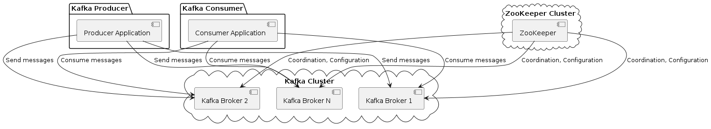
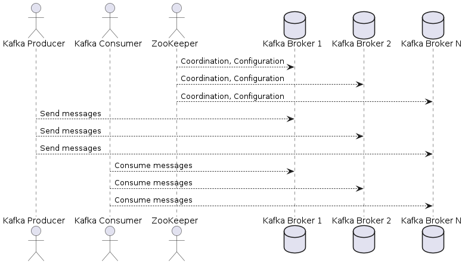
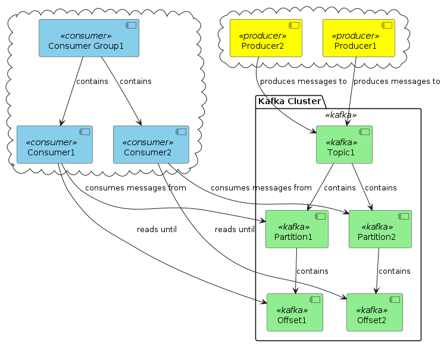

# Kafka Fundamentals

**What is Apache Kafka?**

- A high-throughput distributed messaging system.
- A Pub-Sub messaging system.

## Apache Kafka Ecosystem

In the Apache Kafka ecosystem, several components work together to provide a distributed, fault-tolerant, and highly scalable **messaging platform**. These components are Kafka Broker, ZooKeeper, and Kafka Producers and Consumers.

1. **Kafka Broker**: A Kafka broker is a **server** that runs the Kafka software and is responsible for receiving, storing, and delivering messages (records) to **consumers**.
Kafka brokers are organized as a **distributed system**, meaning that multiple brokers can work together to provide data storage, replication, and load balancing. Each broker can handle multiple topic partitions, which store the actual message data. Kafka brokers are designed to be fault-tolerant, and data is replicated across multiple brokers to prevent data loss in case of a broker failure.

2. **ZooKeeper**: Apache ZooKeeper is a **distributed coordination service** that Kafka relies on for various tasks, such as managing configuration data, leader election, and detecting broker failures.
In a Kafka cluster, ZooKeeper is responsible for maintaining a list of available brokers, tracking the state of each broker, and helping to elect the controller broker (responsible for managing partition leaders and replica sets). Although Kafka has been working on removing the dependency on ZooKeeper (KIP-500), many Kafka deployments still use ZooKeeper as a critical component.

3. **Kafka Producer**: A Kafka producer is an **application** or system that sends messages to Kafka topics.
Producers write data to one or more Kafka topics by specifying the topic name and the message content (key-value pairs). Kafka producers can choose different partitioning strategies to distribute messages across topic partitions for better load balancing and parallelism.

4. **Kafka Consumer**: A Kafka consumer is an **application** or system that reads and processes messages from Kafka topics.
Consumers are part of consumer groups, which allow parallel consumption of topic partitions by multiple instances of a consumer application. Kafka tracks the progress of each consumer in a group by maintaining **offsets**, which represent the position of the last consumed message in a partition. This enables consumers to resume processing from where they left off in case of a restart or failure.

In the example project, we provided steps to set up a Kafka broker and ZooKeeper server locally.

- When you start the ZooKeeper server using `bin/zookeeper-server-start.sh config/zookeeper.properties`, you launch a **ZooKeeper instance** with the provided configuration.
- Similarly, when you start the Kafka server using `bin/kafka-server-start.sh config/server.properties`, you launch a Kafka **broker instance** with the specified configuration.
Both instances need to be running for your Kafka producer and consumer applications to function correctly.

Here's a PlantUML **Component diagram** representing the Apache Kafka ecosystem, including Kafka Producers, Kafka Brokers, ZooKeeper, Kafka Consumers,



Here's a PlantUML **Action diagram** representing their interactions:



## Kafka Communication Protocol

Kafka uses a custom binary protocol over TCP for communication between **clients** (producers and consumers) and brokers. This protocol is designed to be high-performance, efficient, and extensible. Some key features of the Kafka protocol include:

1. **Request-response**: The Kafka protocol follows a request-response pattern, where clients send requests to brokers, and brokers respond with the requested data or an acknowledgment.

2. **API keys**: Each **request type** in the Kafka protocol is identified by an API key. This makes it easy to add new request types or extend existing ones without breaking compatibility.

3. **Versioning**: The Kafka protocol supports multiple versions for each request type, enabling the addition of new features and maintaining backward compatibility with older clients.

4. **Batching**: The Kafka protocol supports batching of messages to optimize network usage and reduce overhead, resulting in better throughput and latency.

5. **Compression**: Kafka supports message compression (GZIP, Snappy, LZ4, and ZSTD) to reduce network traffic and storage requirements.

### Broker: Configuring the Broker Address

The broker address is an essential configuration parameter for Kafka producers and consumers, as it specifies the location of the Kafka broker(s) to connect to. The broker address is provided as a list of `host:port` pairs separated by *commas*. The configuration parameter for setting the broker address in Kafka clients is called `metadata.broker.list` or `bootstrap.servers` (depending on the client library).

For example, broker address is configured using the following code snippet:

```cpp
Configuration config = {
    {"metadata.broker.list", "localhost:9092"}
};
```

This configuration tells the Kafka producer and consumer to connect to a Kafka broker running on the local machine at port 9092. In a production environment, you would replace `localhost:9092` with the actual addresses of your Kafka brokers, e.g., `broker1.example.com:9092,broker2.example.com:9092`.

## C/C++ Libraries

In the C++ ecosystem, there are several libraries and tools available for developing Kafka-based applications. Some of the notable ones are:

- **librdkafka**: librdkafka is a *C library* that provides a high-performance implementation of the Kafka Producer and Consumer APIs. It is used by many Kafka clients, including *cppkafka*, and provides a *native C++ interface* for developing Kafka applications.

  *Note*: The Apache Kafka project only directly supports the Kafka Streams API in Java. The C/C++ library, librdkafka, supports the basic **producer and consumer APIs**, but it does not support the higher-level APIs, such as **Kafka Streams API** (with stream processing capabilities) and **Kafka Connect API**

- **cppkafka**: cppkafka is a *C++ wrapper* for the librdkafka C library, which provides a modern and high-level API for producing and consuming messages with Kafka. It simplifies the development and configuration of Kafka producers and consumers, while still allowing you to use the powerful features of librdkafka.

While the C++ ecosystem does not have as many Kafka libraries as other languages like Java or Python, there are a few additional libraries that can be used to develop Kafka-based applications.

- Simple C++ Kafka Client (**SiSyPhe**): SiSyPhe is a lightweight C++ Kafka client library built on top of *librdkafka*. It simplifies the development of Kafka producers and consumers by providing a more user-friendly and straightforward API while still retaining the performance and flexibility offered by librdkafka.

The SiSyPhe library can be a helpful tool when developing Kafka-based applications in C++. The library provides a more straightforward API compared to librdkafka, making it easier to build and maintain Kafka producers and consumers while still maintaining the performance benefits of the underlying librdkafka library.

However, it's important to note that the SiSyPhe library is not as widely used or mature as other libraries like cppkafka or librdkafka. When choosing a library for your project, consider factors such as community support, feature set, and compatibility with your application requirements and constraints.

- Faust Stream Processing (**FaustCpp**): FaustCpp is a C++ library built on top of Faust, a stream-processing library inspired by Kafka Streams. It provides an API to define data stream processing pipelines in C++ and leverages Faust for execution. Although FaustCpp is not as mature and widely used as Kafka Streams, it offers an alternative for developers looking for stream-processing capabilities in C++.

- **Kafka Connect**-like functionality in C++: While there isn't a direct equivalent to Kafka Connect in C++, you can develop custom Kafka producers and consumers using existing C++ Kafka libraries like **cppkafka** or **librdkafka** to integrate with various data sources and sinks.

For instance, you can create a custom C++ Kafka producer that reads data from a database and sends it to a Kafka topic. Similarly, you can create a custom C++ Kafka consumer that reads data from a Kafka topic and writes it to another data sink, such as a database or file storage system.

By following this approach, you can develop Kafka-based applications in C++ that perform similar functions to **Kafka Connect**, although you'll need to handle the custom implementation and error handling on your own.

While these solutions do not provide an exact equivalent to Kafka Connect or **Kafka Streams** for the C++ ecosystem, they can serve as alternatives when developing Kafka-based applications in C++ with similar functionality.

## Concepts

### **Topic**

A Topic is a category or feed name to which records are published. Topics in Kafka are always multi-subscriber, meaning that a topic can have zero, one, or many consumers that subscribe to the data written to it.

Here are some key points about Kafka topics:

- Producers write data to topics and consumers read from topics.
- Topics are split into partitions for parallelism and fault-tolerance.
- Each message within a partition gets an *incremental id*, called the **offset**.
- Once published to a Kafka topic, records are *immutable*, i.e., they cannot be changed.

### **Partition**

Partitions are a way of dividing the data or messages in a Kafka topic. Each partition is an ordered, immutable sequence of records that is continually appended to a structured commit log. The records in the partitions are each assigned a sequential id number called the **offset**, which uniquely identifies each record within the partition.

Here are some key points about Kafka partitions:

- Topics are split into one or more partitions. This allows multiple consumers to read from a topic in parallel.
- Each partition can be placed on a separate machine to allow for multiple data writes and reads, thus improving the performance of Kafka.
- Partitions are also used for fault-tolerance. Each partition can be *replicated* across multiple nodes, which means that even in the case of a node failure, the Kafka cluster will continue to run.
- Kafka guarantees that records stored in a partition will be read in the order they were produced. If you require your messages to be in order, this is a significant aspect to consider.

For example, let's say you have a topic "Logs" which is used to keep the log information. This topic could have multiple partitions, and when a producer sends a message to the "Logs" topic, it can choose which partition to send the message to. On the consumer side, each consumer could read messages from a different partition, allowing for parallel consumption of data.

### **Consumer Group Design**

In Kafka, consumers read from topics. If you have multiple consumers that need to read from the same topic, you can organize them into a consumer group. Each message in a topic will be delivered to one consumer within each subscribing consumer group. Consumers within a group divide up the partitions in the topic and each consumer reads from its "own" partitions.

By using consumer groups, you can allow your application to process messages in parallel and thus read from topics more quickly. You can also ensure that each message is processed by exactly one consumer in the group.

### **The Offset**

A placehoder:

- last read message position
- maintained by the Kafka Consumer
- Corresponds to the message identifier



In the above diagram,

- `Topic1` contains `Partition1` and `Partition2`. Each `Partition` contains its respective `Offset`.
- `Producer1` and `Producer2` produce messages to `Topic1`.
- `Consumer1` and `Consumer2` consume messages from `Partition1` and `Partition2` respectively, and each reads messages until its respective `Offset`.
- `Consumer Group1` contains `Consumer1` and `Consumer2`.

This diagram represents a more realistic scenario where you have multiple producers and consumers interacting with multiple partitions within a topic.

### **Message Content**

Each message has a:

- Timestamp
- Referenceable identifier
- Payload (binary)

### **Delivery Guarantees (Producer)**

- Broker acknowledgemetn ("acks")
  - 0: fire and forget
  - 1: leader acknowledged
  - 2: replication quorum acknowledged
- Broker responds with error
  - "retries"
  - "retry.backoff.ms"

### **Ordering Guarantees (Producer)**

- Message order by partition
- Can get complicated with errors
- Delivery semantics
  - at-most-one
  - at-least-once
  - only-once
  
### **Message Retention Policy**

TODO

### **Replica in Kafka**

In Apache Kafka, a replica refers to the replication of a Kafka topic's partition. Replicas are an essential concept that ensures fault-tolerance in Kafka. There are two types of replicas:

1. **Leader Replica**: For each partition, one of the brokers is chosen as the leader. This broker is responsible for all reads and writes for the given partition. When any producer sends a message pertaining to a particular topic, this message is sent to the partition's leader broker.

2. **Follower Replica**: Other brokers that replicate the leader's log are known as follower replicas. They are passive and just copy the leader's data. Their main purpose is to serve as a replacement in case the leader broker goes down.

Each topic has a replication factor that indicates how many copies of a topic's partition should exist. If a replication factor is three, Kafka will create three identical copies of each partition. Partitions can have multiple replicas for fault-tolerance, which are stored on separate Kafka brokers. Each partition has one leader replica and zero or more follower replicas. The leader replica handles all read and write requests for the partition, while the follower replicas passively replicate the leader. If the leader fails, one of the followers will automatically be promoted to be the new leader.

Here is a visual representation to illustrate this:

```
Topic: TestTopic
|               Broker 1              |               Broker 2              |               Broker 3              |
|-------------------------------------|-------------------------------------|-------------------------------------|
| Partition 1 (leader)               | Partition 2 (follower)              | Partition 1 (follower)              |
| Partition 2 (follower)             | Partition 1 (follower)              | Partition 2 (leader)                |
```

In this example, `TestTopic` is split into two partitions. Each partition has one leader and two followers, distributed across three brokers.

A few key points:

- Each message written to a partition gets a sequential id number called the offset.
- Kafka guarantees that records in a partition will be kept in the order they were written.
- The offset for a record being added to a partition is always increasing.
- The followers consume records from the leader just like a normal Kafka consumer. When the followers are up to date with the leader, they are said to be in-sync.
- In case of a leader replica's failure, one of the in-sync replicas will be chosen as the new leader.

This design allows Kafka to be both highly scalable and fault-tolerant. You can increase throughput by increasing the number of partitions in a topic, and increase fault tolerance by increasing the number of replicas for each partition. The Kafka cluster balances replicas across all the brokers to spread the load.

Replication provides two primary benefits:

- It ensures **Durability**: Since data is copied to other brokers, data loss can be prevented in the event of a broker's failure.
- It ensures **High Availability**: If a leader broker goes down, one of the follower replicas can be ***elected*** as the new leader to continue serving client requests.

**Code Example**

The Kafka **replication factor** is typically set at topic creation time. This can be done using the `kafka-topics` CLI command:

```bash
bin/kafka-topics.sh --create --bootstrap-server localhost:9092 --replication-factor 3 --partitions 1 --topic MyTopic
```

Here we create a topic named `MyTopic` with a replication factor of 3 and 1 partition. The `--bootstrap-server` option specifies the address of the Kafka server.

In C++, the replication factor is abstracted away. You don't specify the replication factor in your code. Your code just interacts with topics. Underneath, Kafka will ensure that data is replicated according to the replication factor set at topic creation time.

For example, a producer in C++ would produce messages like this, not aware of the underlying replicas:

```cpp
std::string brokers = "localhost:9092";
std::string errstr;
std::string topic_str = "MyTopic";

RdKafka::Conf *conf = RdKafka::Conf::create(RdKafka::Conf::CONF_GLOBAL);
conf->set("bootstrap.servers", brokers, errstr);

RdKafka::Producer *producer = RdKafka::Producer::create(conf, errstr);

RdKafka::Topic *topic = RdKafka::Topic::create(producer, topic_str,
                                               topic_conf, errstr);

std::string message = "message content";
producer->produce(topic, RdKafka::Topic::PARTITION_UA,
                  RdKafka::Producer::RK_MSG_COPY, 
                  const_cast<char *>(message.c_str()), message.size(),
                  NULL, NULL);
```

Note: The Kafka client in C++ does not handle the replication directly. It's managed by the Kafka cluster according to the configuration defined when creating the topic. Your client applications (producers and consumers) just read/write from/to a Kafka topic. Underneath, Kafka will take care of replicating the data across different brokers.
